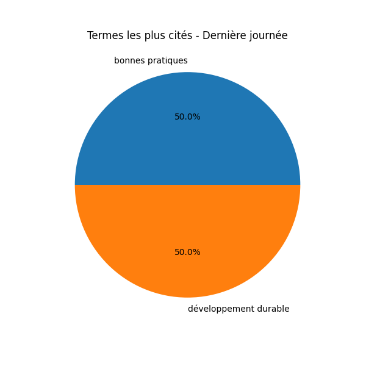
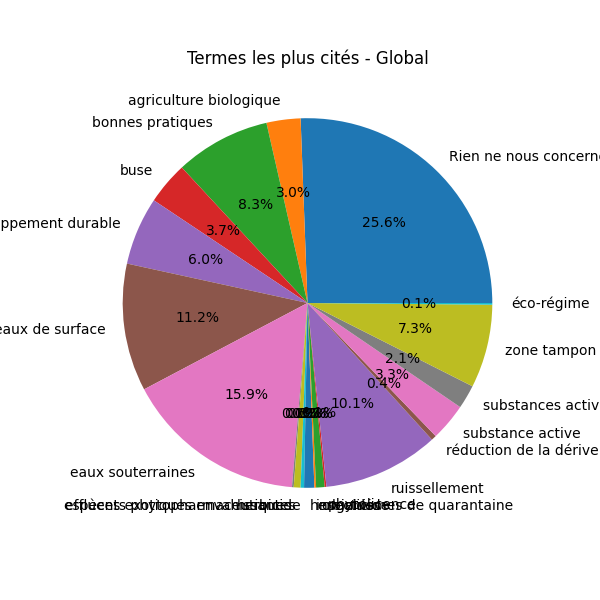
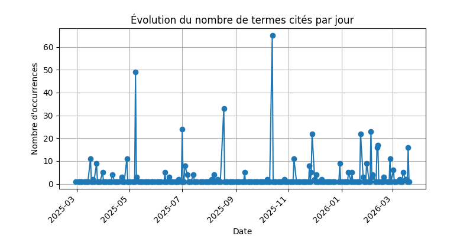

# Rapport quotidien

**Dernière mise à jour : 2026-02-26**

[📥 Télécharger la liste des obeservation en XLSX](https://github.com/LlrdntCORDER/VeilleMoniteur/releases/latest/download/Data.xlsx)

## Termes les plus cités (dernière journée)

### Données de la dernière journée

| Terme                 |   Numéro de page |   Occurences |
|:----------------------|-----------------:|-------------:|
| substance active      |               44 |            1 |
| substance active      |               45 |            3 |
| eaux de surface       |              104 |            1 |
| zone tampon           |              105 |            2 |
| eaux de surface       |              106 |            1 |
| zone tampon           |              108 |            1 |
| développement durable |              171 |            1 |
| ruissellement         |              218 |            1 |

## Évolution globale

