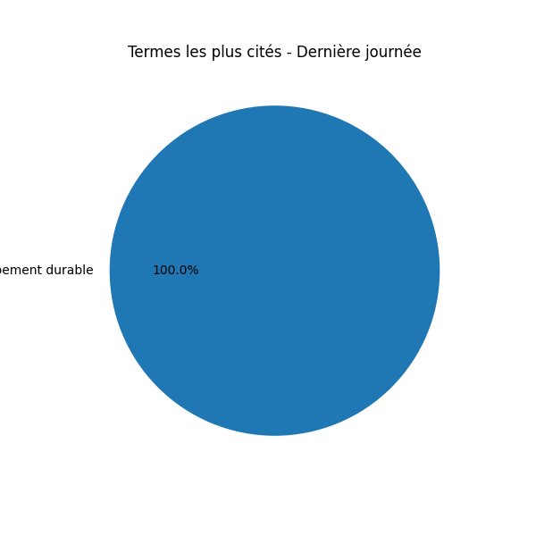

# Rapport quotidien

**Dernière mise à jour : 2026-03-19**

[📥 Télécharger la liste des obeservation en XLSX](https://github.com/LlrdntCORDER/VeilleMoniteur/releases/latest/download/Data.xlsx)

## Termes les plus cités (dernière journée)

### Données de la dernière journée

| Terme                 |   Numéro de page |   Occurences |
|:----------------------|-----------------:|-------------:|
| développement durable |                7 |            1 |
| développement durable |               44 |            1 |
| bonnes pratiques      |              122 |            1 |
| eaux souterraines     |              126 |            1 |
| ruissellement         |              126 |            2 |
| bonnes pratiques      |              134 |            1 |
| eaux souterraines     |              138 |            1 |
| ruissellement         |              138 |            2 |
| bonnes pratiques      |              145 |            1 |
| eaux souterraines     |              149 |            1 |
| ruissellement         |              150 |            2 |
| développement durable |              165 |            2 |

## Évolution globale

